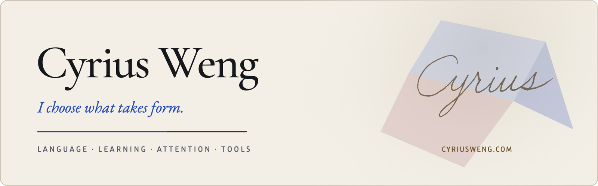

<picture>
  <source media="(prefers-color-scheme: dark) and (max-width: 600px)" srcset="./assets/header-mobile-dark.png">
  <source media="(max-width: 600px)" srcset="./assets/header-mobile-light.png">
  <source media="(prefers-color-scheme: dark)" srcset="./assets/header-dark.png">
  
</picture>

I work in English education. Earlier roles in editorial review and financial services shaped habits I still use every day: attending to evidence, finding structure, choosing exact words and staying aware of consequence.

I build tools around the way I read, write and work. Recent projects bring that attention to the page itself, the controls around it and the decisions an AI assistant makes along the way.

[Writing](https://cyriusweng.com) · [LinkedIn](https://www.linkedin.com/in/cyriusweng) · [Bluesky](https://bsky.app/profile/cyriusweng.com) · [X](https://x.com/cyriusweng)

## Recent work

### [Cyriform for Obsidian](https://github.com/cyriusweng/cyriform-theme)

An editorial theme shaped by typography, reading space and a shared visual language across light and dark modes. Five atmospheres adjust the feel of a workspace, while 89 Style Settings controls expose its typography, colour and layout.

[Cyriform Companion](https://github.com/cyriusweng/cyriform-companion) brings those choices into the note: searchable visual pickers for page styles, callouts, highlights, tasks and image layouts. Both are available through Obsidian’s community directory.

### Tools for [Oh My Pi](https://github.com/can1357/oh-my-pi)

[OMP Code Model](https://github.com/cyriusweng/omp-code-model) keeps planning, implementation and review in one conversation. It switches to a configured coding model for implementation and restores the original model for review, carrying the history and tool state through the change. Recent work adds Jev-assisted routing and configurable fallbacks.

[OMP Jev Gate](https://github.com/cyriusweng/omp-jev-gate) adds focused semantic checks through TypeSafe Jev: prompt preflight, an explicit judgment tool, advisory guidance and enforceable checkpoints, with session receipts that make the decisions inspectable.

## More projects

### [Opal for Obsidian](https://github.com/cyriusweng/opal-theme)

An Obsidian theme with paired light and dark appearances, accessibility checks and extensive Style Settings controls. [Opal Companion](https://github.com/cyriusweng/opal-companion) adds visual controls for note states, callouts, highlights, tasks and image layouts.

### Everyday tools

- [Transmission Global Trackers](https://github.com/cyriusweng/transmission-global-trackers): daily-validated public tracker lists and tiered Transmission configurations.
- [Local AI Bookmark Organizer](https://github.com/cyriusweng/local-ai-bookmark-organizer): a bookmark cleaner and organiser using Python and Ollama models.

## Upstream work

My retry fix for interrupted Python HTTP responses forwarded through proxies was merged into [Oh My Pi](https://github.com/can1357/oh-my-pi) in [PR #11160](https://github.com/can1357/oh-my-pi/pull/11160) and released in [v18.1.17](https://github.com/can1357/oh-my-pi/releases/tag/v18.1.17).
